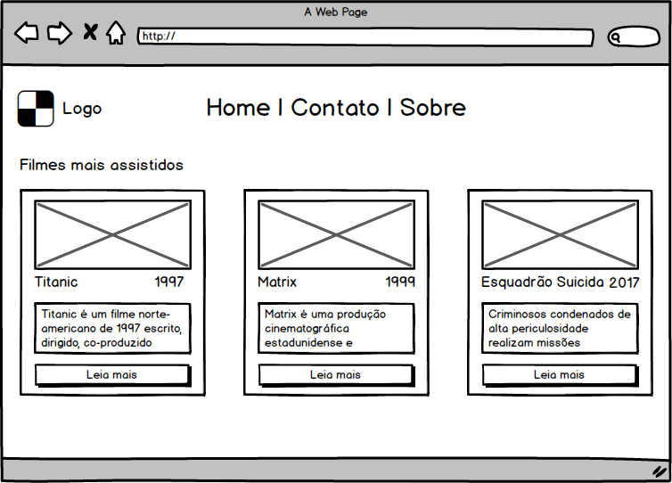

# Projeto 1

## Descrição do projeto :ghost:

O projeto consiste na elaboração de uma página HTML/CSS que atenda os requisitos do mockup apresentado a seguir:

### Requisitos para Avaliação 1 (50% da avaliação)

O projeto deve conter apenas HTML/CSS sem o uso de frameworks. O Código será analisado e discutido com o professor.

Os seguintes requisitos estão previstos para a primeira parte da avaliação:

* Página Inicial (única página)

* Logotipo com imagem

* Menu central

* Descrição de seção

* 3 Cards de Filmes

  * Imagem no card
  
  * Título do filme alinhado à esquerda
  
  * Ano do filme alinhado à direita
  
  * Descrição do filme
  
  * Botão de Leia mais

### Requisitos para Avaliação 2 (10% da avaliação)

Refatoração da página com significancia semântica, atendendo as recomendações da W3C

### Requisitos para Avaliação 3 (40% da avaliação)

Refatoração da página para atender requisitos de responsividade, como é convencianado para diversos dispositivos.

## Guia de estudo :ghost:

Esses links são excelentes materiais, tanto para estudar para a avaliação escrita quanto para desenvolver o projeto!

https://www.w3schools.com/html/default.asp

https://www.w3schools.com/css/default.asp

https://pt.khanacademy.org/computing/computer-programming/html-css

https://www.caelum.com.br/apostila-html-css-javascript/

https://www.codecademy.com/catalog/language/html-css

## Entrega :ghost:

Data: 22/11/2017

### Realização da entrega

O projeto deverá estar em um repositório público do github. O link do repositório deverá ser postado em uma nova Issue deste repositório, com o nome do aluno como título!

Até a data da entrega, o professor poderá fazer comentários e sugestões de melhoria para nota. Sugestões seguintes à data da entrega não contarão como nota!

