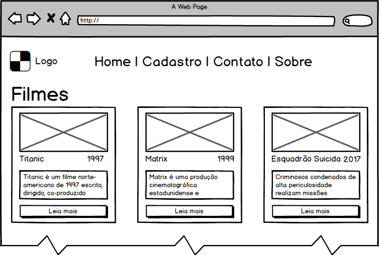
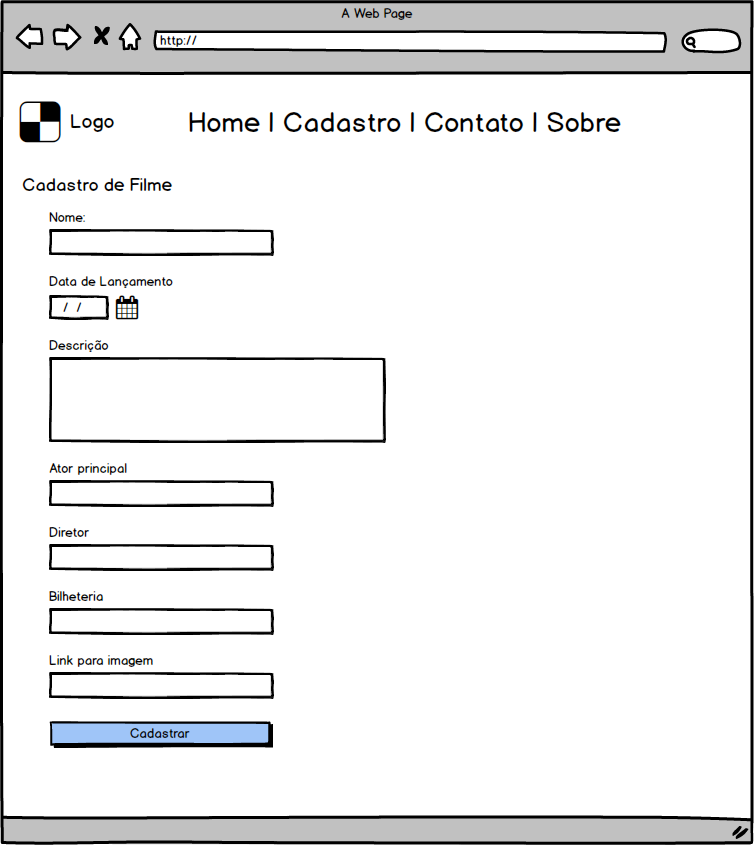
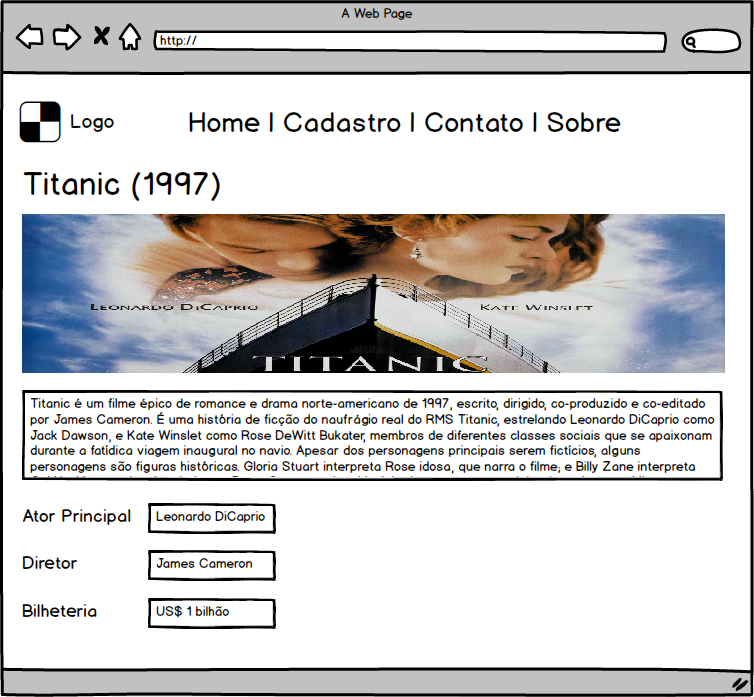

# Projeto 2

O projeto consiste na elaboração de um sistema web que atenda os requisitos apresentados a seguir. Os mockups servem de guia para o projeto:

### Requisitos para Avaliação (50% da avaliação)

O projeto deve conter toda a estrutura do código identado. O código dever ser claro e sem redundâncias. A escolha de um framework ou padrão de projeto (MVC, MVVM, etc) é arbitrária.

O projeto prevê a criação de um sistema web que permita a um usuário qualquer cadastrar novos filmes (requisitos logo abaixo). A página inicial mostrará dados resumidos dos filmes cadastrados (mockup). Uma opção de 'leia mais' apresentará uma próxima página com detalhes sobre o filme selecionado.

Os seguintes requisitos estão previstos para a primeira parte da avaliação:

* Página Inicial (baseada no mockup apresentado)
  
  * A página inicial apresenta todos os filmes que são cadastrados a partir da página de cadastro

* Página de Cadastro de Filmes
  
  * Permitir a inserção de um nome, data de lançamento, descrição, ator principal, diretor principal, bilheteria e um link para uma imagem hospedada na internet.  

### Requisitos para Avaliação(40% da avaliação)

* Página de detalhes

  * Esta página deve ser acessada quando o usuário clicar sobre a opção 'leia mais'. Ela deve conter todos os dados do respectivo filme selecionado

### Requisitos para Avaliação (10% da avaliação)

* Página de sobre com detalhes sobre quem desenvolveu o site. Seguir o exemplo de outros sites. O layout final conta como nota

* Página de contato com um formulário a ser preenchido pelo usuário do site. Não é necessário estar funcionando o formulário. O layout final conta como nota

### Mockups

Página de consulta de filmes

Página de cadastro de filmes

Página de detalhe de filme

## Guia de estudo

Esses links são excelentes materiais, tanto para estudar para a avaliação escrita quanto para desenvolver o projeto!

https://github.com/braziljs/eloquente-javascript

https://www.w3schools.com/js/default.asp

https://www.caelum.com.br/apostila-html-css-javascript/

https://firebase.google.com/docs/web/setup

### PHP com PDO

https://gist.github.com/bmarchete/d313098918693594ff7f4071309bf80e

## Entrega

Data: 20/12/2017

### Realização da entrega

O projeto deverá estar em um repositório público do github. O link do repositório deverá ser postado em uma nova Issue deste repositório, com o nome do aluno como título!

Até a data da entrega, o professor poderá fazer comentários e sugestões de melhoria para nota. Sugestões seguintes à data da entrega não contarão como nota!

